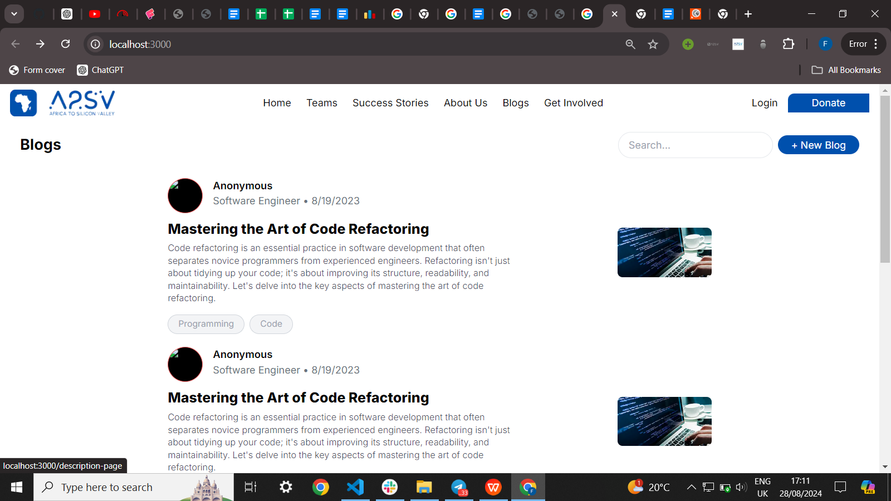
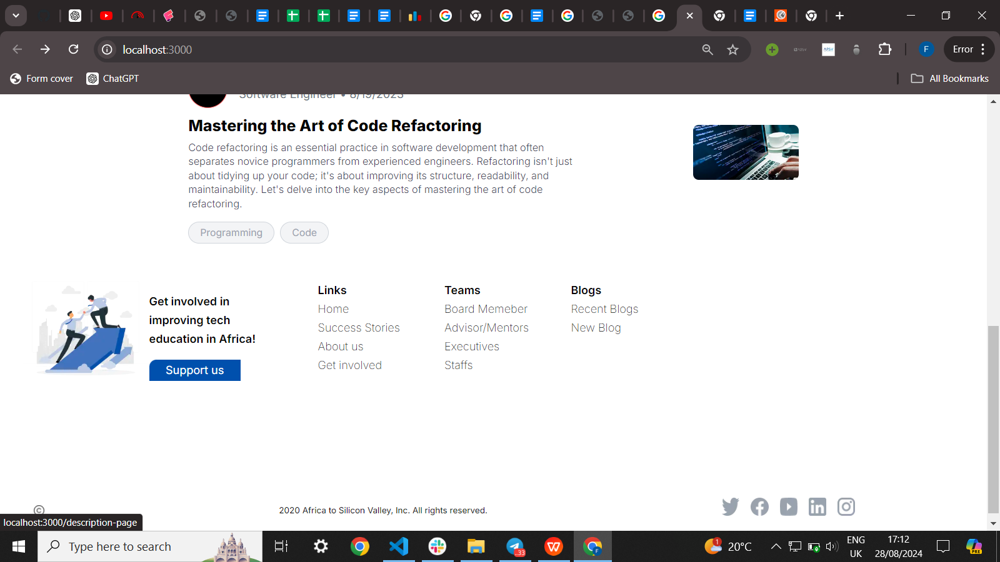
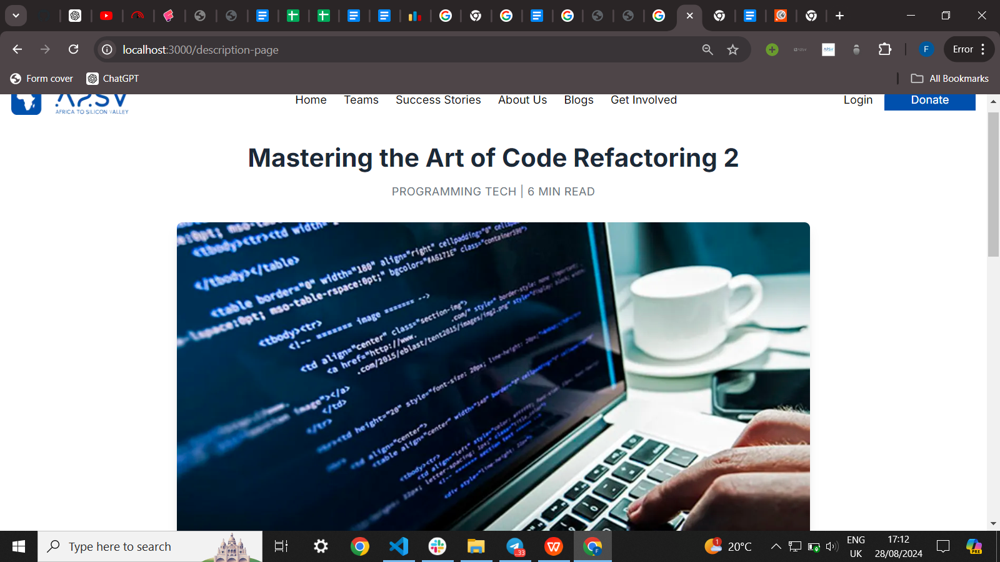
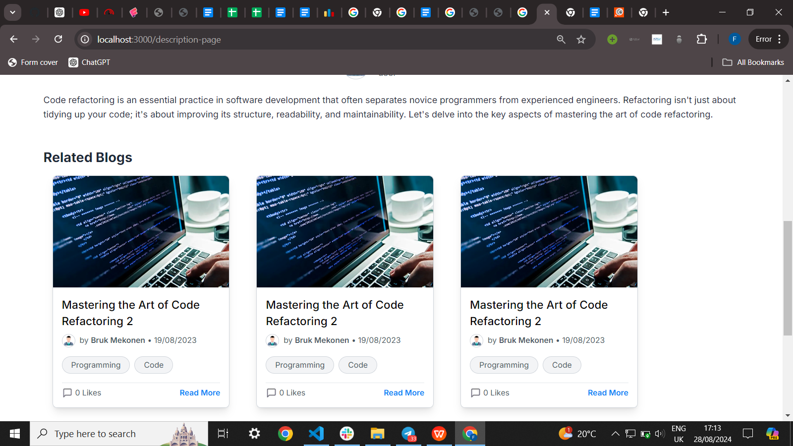
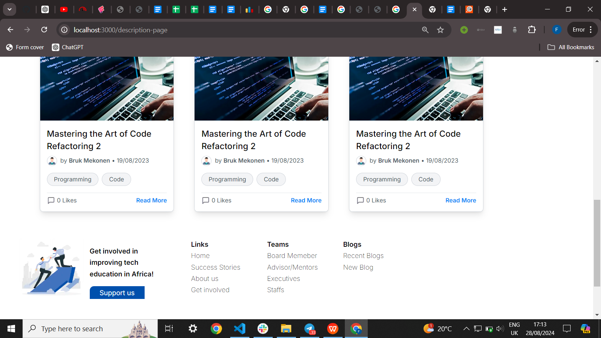

Blog Post application
The Blog Post Application is a dynamic platform that allows users to seamlessly post, read, and explore blogs. Built with Next.js, Tailwind CSS, React, and TypeScript, this application provides a robust and scalable solution for content management and consumption.

Features
User-Friendly Interface: An intuitive design powered by Tailwind CSS, ensuring a clean and responsive user experience across various devices.
TypeScript Integration: Utilizes TypeScript for enhanced code quality and developer experience, ensuring better maintainability and scalability.

when 1 blog is clicked it will go to a description page 

